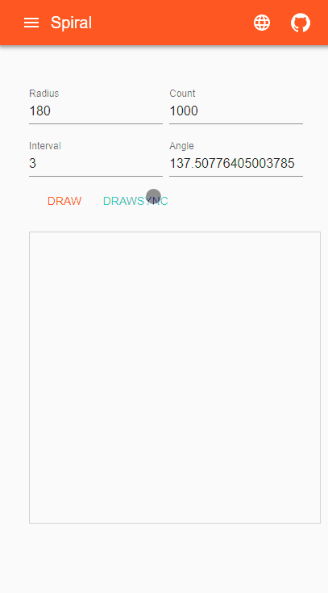
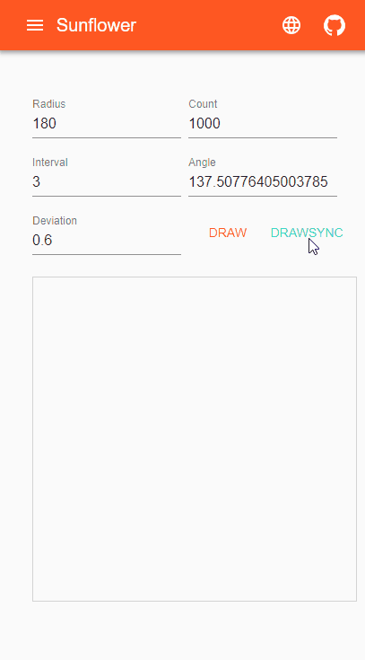

<h1 align="center">

react-sunflower

</h1>

## Description

react-sunflower is a project which draws spiral and sunflower for fun.

The caculating algorithm is inspired by this great article -- [[Circles, Spirals and Sunflowers]](https://krazydad.com/tutorials/circles_js/).

The project is created with [nextjs](https://github.com/zeit/next.js/), [material-ui](https://github.com/mui-org/material-ui) and [nextjs-mui-helper](https://github.com/mui-org/material-ui).

You can change the angle to re-draw to see the difference with golden angle.

## Preview

1. Draw spiral (GoldenAngle).

2. Draw sunflower (GoldenAngle).

## License

This project is licensed under the terms of the
[MIT license](/LICENSE).